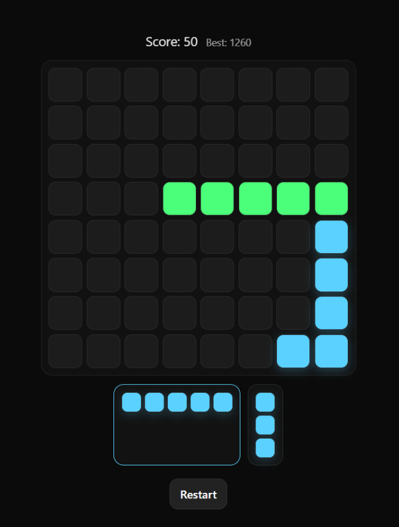
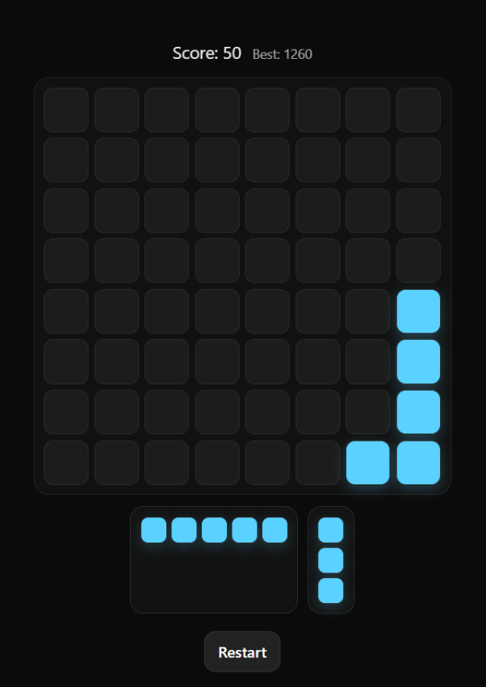
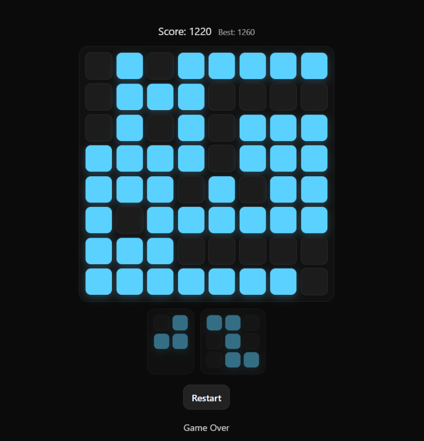

# 🧩 Block Puzzle Web (React + TypeScript + OOP)

Clone versi web dari game puzzle ala Block Blast, dibuat menggunakan:

- ⚡ Vite  
- ⚛️ React  
- 🟦 TypeScript  
- 🧠 OOP Game Engine Architecture  
- 🖱️ Pointer-based Drag & Drop  

---

## ✨ Features

- ✅ 8x8 Grid Board
- ✅ 3-Piece Tray System
- ✅ Drag & Drop (Pointer Events API)
- ✅ Snap Preview (Valid / Invalid Highlight)
- ✅ Row & Column Clear (No Gravity)
- ✅ Score System
- ✅ Best Score Tracking
- ✅ Game Over Detection
- ✅ Responsive Layout
- ✅ Clean OOP Separation (Engine & UI)

---

## 🏗️ Architecture

Project ini memisahkan logic game dan UI dengan jelas:

```
src/
│
├── engine/
│ ├── Board.ts // Grid logic & collision detection
│ ├── Game.ts // Game rules, scoring, tray system
│ └── pieces.ts // Piece definitions (matrix 0/1)
│
├── ui/
│ ├── BoardView.tsx
│ ├── PieceTray.tsx
│ └── PieceView.tsx
│
└── App.tsx
```


### Engine Layer (Pure TypeScript, OOP)

- Tidak bergantung pada React
- Bertanggung jawab atas state & rules
- Mudah untuk di-test
- Menggunakan Uint8Array untuk efisiensi grid

### UI Layer (React)

- Render berdasarkan snapshot dari engine
- Mengatur drag & drop
- Tidak menyimpan game logic

---

## 🎮 Gameplay

- Pemain diberikan 3 piece setiap ronde
- Piece bisa di-drag dan di-drop ke grid
- Jika satu baris atau kolom penuh → otomatis terhapus
- Jika tidak ada piece yang bisa ditempatkan → Game Over

---

## 📸 Screenshots

### Gameplay


### Drag & Drop Preview


### Piece Tray


### Gameover

---

## 🚀 Installation

Clone repository:

```bash
git clone https://github.com/daffafikri19/block_blaster.git block_blaster
cd block_blaster
